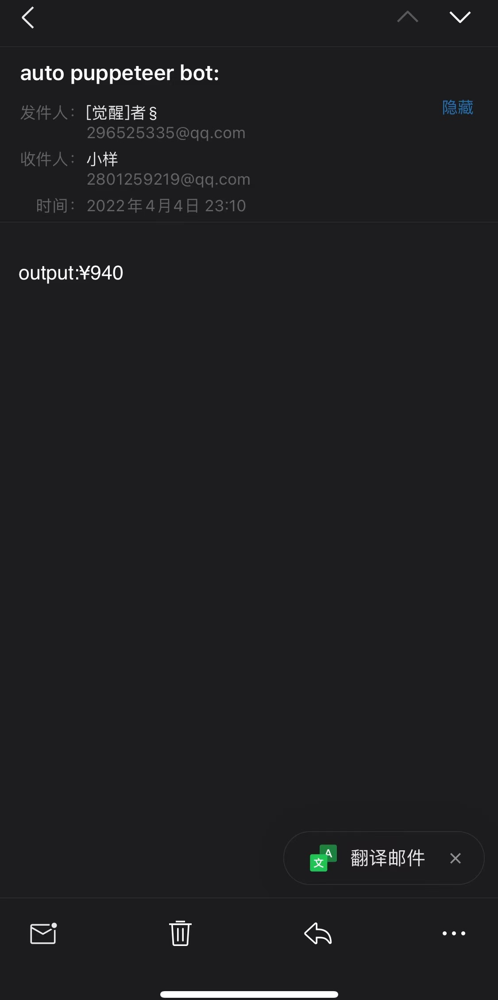

# chrome-recoder-crawler

[README](./README.md)

对谷歌浏览器recorder导出的.js文件进行修饰，默认以最后一步操作的节点的innerText属性作为目标爬取值，你也可以修改修饰后的.js文件中的step函数名称，只要名称不是以‘step’开头，工具就会抓取目标元素的innerText作为结果。然后在配置的截至时间之前，按一定时间间隔，不断轮询获取（执行修饰后的.js文件）结果，并将结果通知到目标邮箱。

## 配置文件 .json
``` javascript
{
  "emailConfig": { // email config
    "host": "smtp.qq.email",
    "service": "qq",
    "port": 465,
    "secureConnection": true,
    "auth": {
        "user": "auth@qq.com",
        "pass": "your smtp pwd", // @qq.com can see https://laowangblog.com/qq-mail-smtp-service.html
    },
    "to": "to@qq.com" // send result to this email address
  },
  "timespan": 1800000 // execution interval
  "until": "2022/5/31", // loop execute the transformed recoder file until this time
  "recoderFile": "./demo/xiecheng.js" // recoder file path
}
```

## 依赖安装
``` shell
npm i
```

## 使用方式

``` shell
# 初始化
node ./index.js ./config.json
# 修改初始化输出的文件，重命名其中的step函数名称，然后保存，进程会马上执行一次文件
```

## 注意事项
建议使用无痕模式进行recorder，这样能保持环境一致。

## Chrome recorder使用
- 官网：[Chrome recorder](https://developer.chrome.com/docs/devtools/recorder/)
- 流程示例：[Chrome recorder usage](./demo/recoder-demo-720.mov)

## 结果
