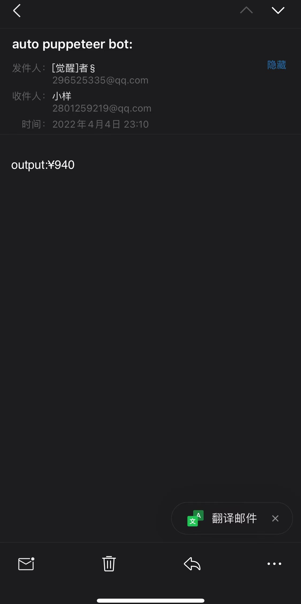

# chrome-recoder-crawler

[README-CN](./README-CN.md)

Modify the .js file exported by Google Chrome recorder. By default, the innerText property of the node operated in the last step is used as the target crawling value. You can also modify the name of the step function in the modified .js file, as long as the name does not start with ' At the beginning of step', the tool will grab the innerText of the target element as the result. Then before the deadline, according to a certain time interval, continuously poll for the result (execute the modified .js file), and notify the result to the target mailbox.

## Config config.json
``` javascript
{
  "emailConfig": { // email config
    "host": "smtp.qq.email",
    "service": "qq",
    "port": 465,
    "secureConnection": true,
    "auth": {
        "user": "auth@qq.com",
        "pass": "your smtp pwd", // @qq.com can see https://laowangblog.com/qq-mail-smtp-service.html
    },
    "to": "to@qq.com" // send result to this email address
  },
  "timespan": 1800000 // execution interval
  "until": "2022/5/31", // loop execute the transformed recoder file until this time
  "recoderFile": "./demo/xiecheng.js" // recoder file path
}
```

## Install
``` shell
npm i
```

## Usage

``` shell
# init
node ./index.js ./config.json
# modify the output file, rename the steps and save, it will be executed immediately

```

## Precautions
It is recommended to use incognito mode for recorder, which can keep the environment consistent.

## Chrome recorder usage
- Official website: [Chrome recorder](https://developer.chrome.com/docs/devtools/recorder/)
- Example: [Chrome recorder usage](./demo/recoder-demo-720.mov)

## Result
